# vDots

## Screenshots
<div style="width: 100%; overflow-x: auto; white-space: nowrap;">
  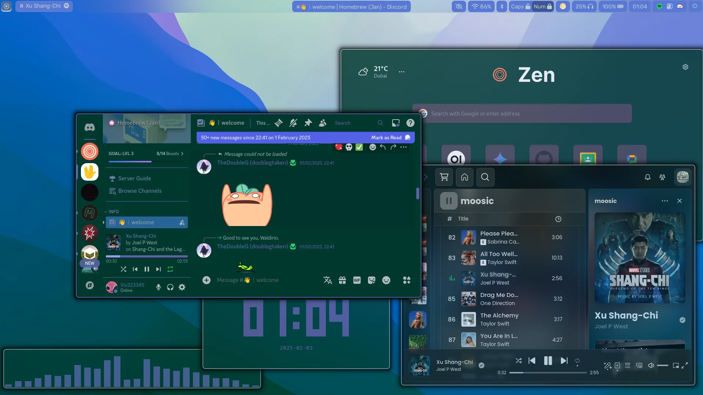
  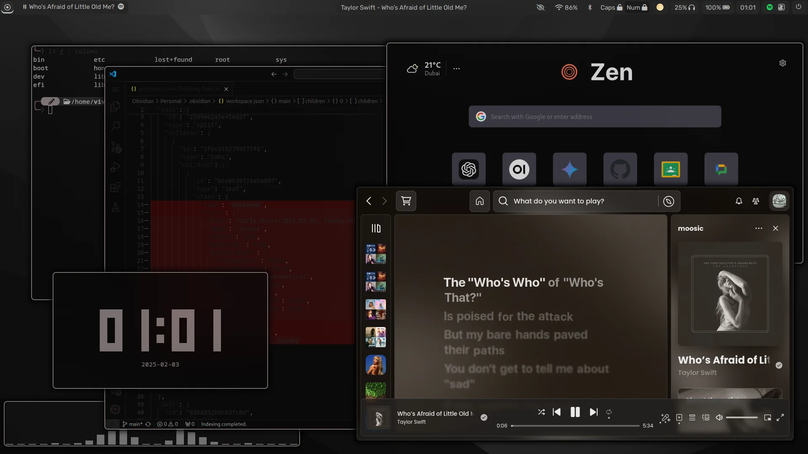
  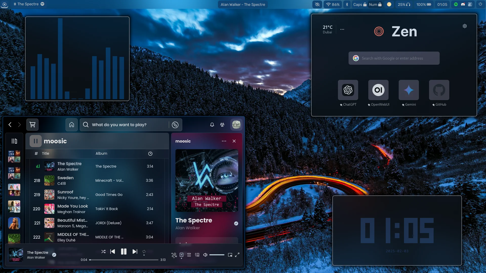
  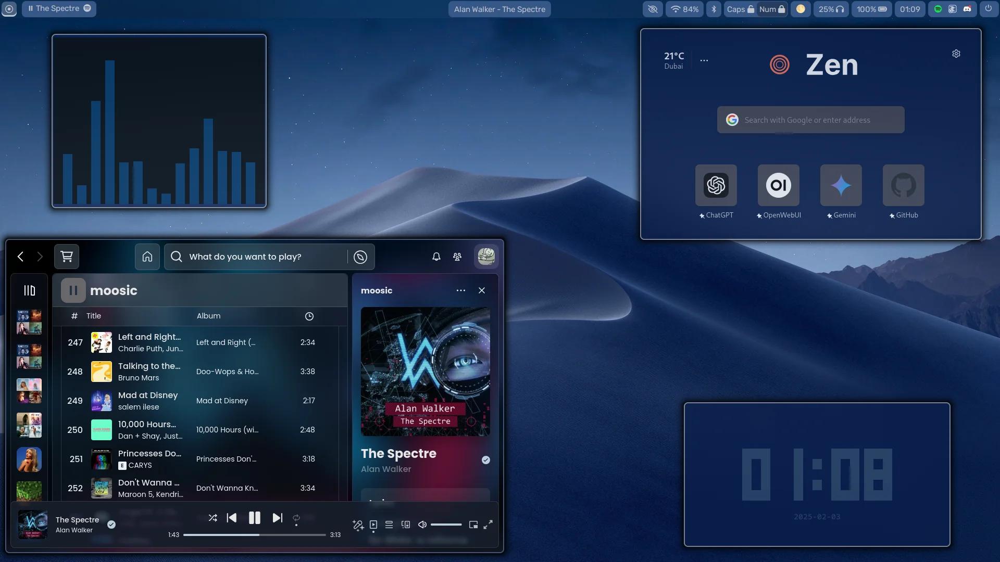
  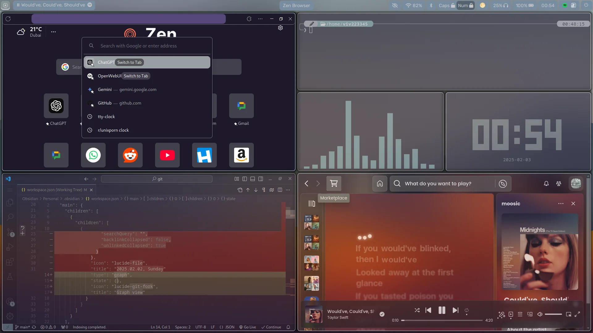
  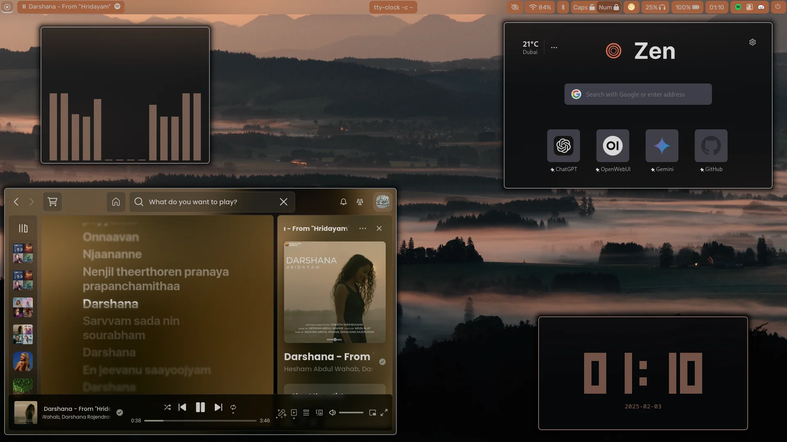
  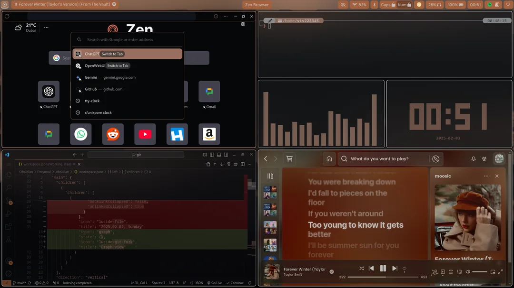
  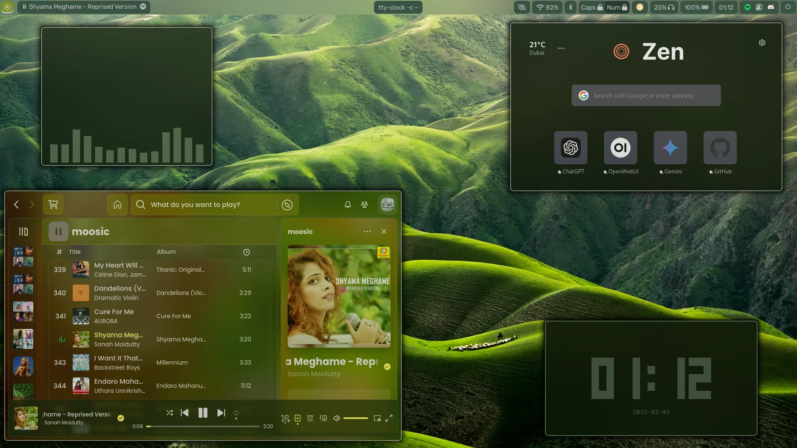
  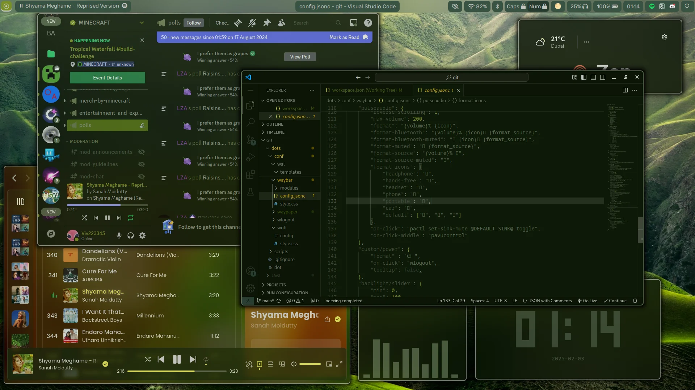
  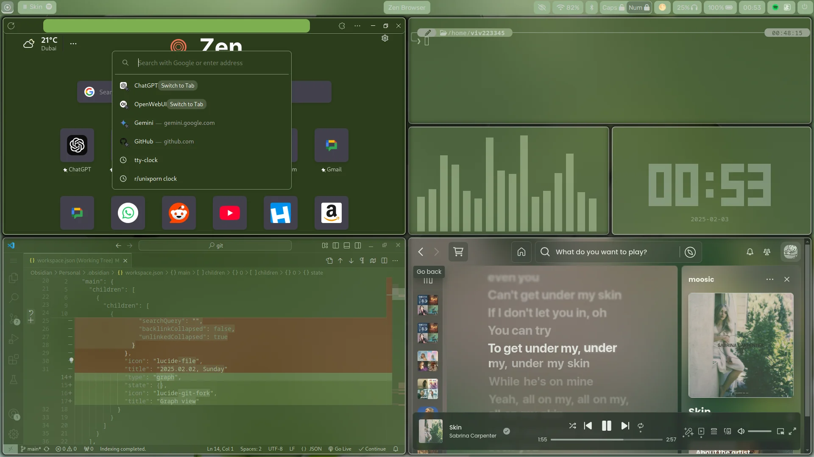
  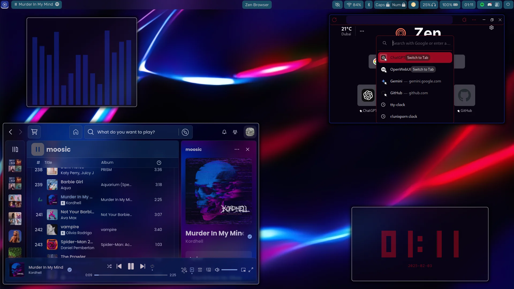
  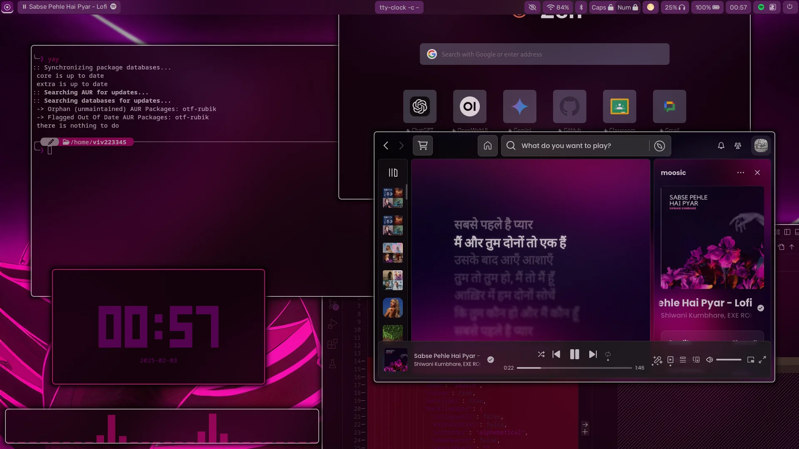
  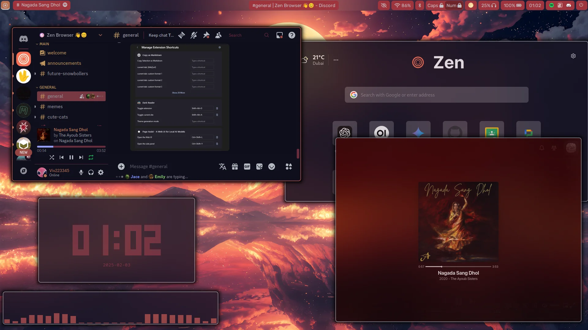
</div>

#### [Wallpapers](media/wallpapers/)

## Dependencies
- hyprland
- btop
- cava
- fuzzel
- kitty
- swaync
- pywal16
- waybar
- waypaper
- wlogout
- brightnessctl

## Installation
```
git clone https://github.com/viv223345/dots.git  # Clone repository
cd dots                                          # Open directory
sudo ./dot make                                  # Install dots
```
# [Dot](dot)
A tool that will comes in handy when managing your dotfiles - even if it's not vDots :)
